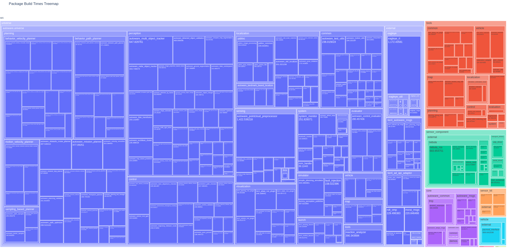
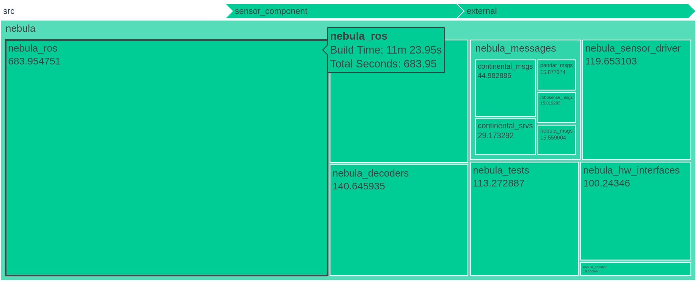

# ROS Build Time Visualizer

A tool to visualize build times for packages in a ROS workspace.

## Features
- Parses ROS `events.log` files to extract build times.
- Constructs a hierarchical directory structure for visualization.
- Generates a treemap of package build times using Plotly.





## Installation

### From Source
1. Clone the repository:
    ```bash
    git clone https://github.com/xmfcx/ros-build-time-visualizer.git
    cd ros-build-time-visualizer
    ```
2. Install the package using `pip`:
    ```bash
    pip install .
    ```

### Using `pip` from GitHub
Alternatively, you can install directly from the GitHub repository:
```bash
pip install git+https://github.com/xmfcx/ros-build-time-visualizer.git
```

## Usage
After installation, you can use the tool via the command line:

```bash
ros-build-time-visualizer /path/to/ros/workspace --output_path build_time_treemap.html --show
```

By default, it uses the latest `events.log` file in the `log` directory of the ROS workspace.

You can specify the path to the `events.log` file directly:

```bash
ros-build-time-visualizer /path/to/ros/workspace --show --log_file=/path/to/ros/workspace/log/build_2024-12-14_00-22-01/events.log
```

If you are in the ROS workspace directory, you can run the tool with the current directory as the argument:

```bash
ros-build-time-visualizer . --output_path log/bla.html --show
```

## Output
The tool generates an interactive treemap (`build_time_treemap.html`) in the current directory, which can be opened in any web browser.

## License
This project is licensed under the Apache 2.0 License. See the `LICENSE` file for details.
